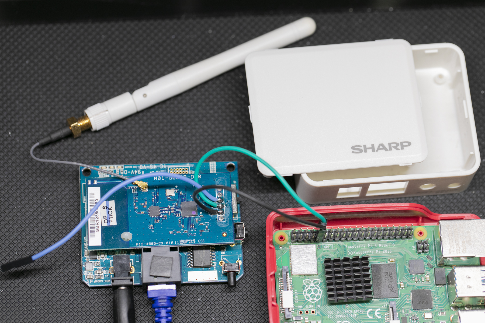
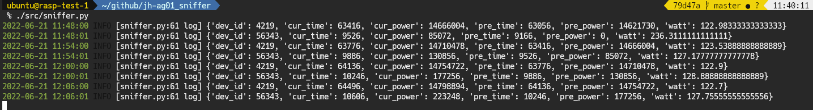

# ⚡ SHARP HEMS ワットメータ

シャープの HEMS コントローラ JH-AG01 のバイナリ通信を解析して電力データを取得するツール

[](https://github.com/kimata/wattmeter-sharp/actions/workflows/regression.yaml)

## 📋 概要

シャープの HEMS コントローラ JH-AG01 のバイナリ形式の内部通信を解析し，電力センサーの計測値を取得するスクリプトです．



### 主な特徴

- ⚡ **リアルタイム電力監視** - HEMS コントローラから電力データを直接取得
- 📊 **多デバイス対応** - 複数の電力プラグの同時監視
- 🔄 **ZMQ PubSub** - サーバー・ロガー間のリアルタイムデータ連携
- 📈 **Fluentd 連携** - データ収集基盤との統合
- 🐳 **Docker サポート** - コンテナ環境での簡単デプロイ
- 🧪 **テスト対応** - pytest による品質保証
- 📝 **設定ファイル** - YAML による柔軟な設定管理

## 🏗️ システム構成

### ハードウェア

- **HEMS コントローラ**: SHARP JH-AG01
- **接続**: UART シリアル通信
- **プラットフォーム**: Raspberry Pi 等

### ソフトウェア

- **言語**: Python 3.10+
- **パッケージマネージャ**: uv
- **メッセージング**: ZMQ (PubSub パターン)
- **データ送信**: Fluentd
- **コンテナ**: Docker
- **設定**: YAML

## 🔧 ハードウェア準備

JH-AG01 を分解し，写真のようにコネクタターミナルから線だしを行い，Raspbeery Pi 等の UART 端子と接続します．

線だしするのは以下の端子になります．

| 端子                   | 信号名  |
| :--------------------- | :------ |
| LANコネクタ側から2番目 | GND     |
| LANコネクタ側から4番目 | TX [^1] |

[^1]: 基板上のシルクは Zigbee モジュール視点で書かれています．

## 🚀 セットアップ

### 必要な環境

- Python 3.10+
- uv (Python パッケージマネージャー)
- UART 対応デバイス (Raspberry Pi 等)

### 1. uv のインストール

```bash
# uv のインストール
curl -LsSf https://astral.sh/uv/install.sh | sh
```

### 2. プロジェクトのセットアップ

```bash
# リポジトリのクローン
git clone https://github.com/your-username/wattmeter-sharp.git
cd wattmeter-sharp

# 依存関係のインストール
uv sync
```

### 3. シリアルポートの設定

デフォルトでは `/dev/ttyAMA0` を使用します。異なるポートを使用する場合は設定ファイルを編集してください。

## 💻 使い方

### 基本的な使用方法

シリアルポートが `/dev/ttyAMA0` の場合，下記のようにします．

```bash
# 基本的な実行
uv run python src/sharp_hems/serial_pubsub.py
```

実行してからしばらくすると，HEMS コントローラが収集したデータが下図のように表示されます．



値の意味は下記のとおりです．

| ラベル    | 内容                                            |
| :-------- | :---------------------------------------------- |
| dev_id    | デバイスID (プラグ個体値)                       |
| cur_time  | 現在の時刻(秒, 0xFFFF になると 0に戻ります)     |
| cur_power | 現在の積算電力(0xFFFFFFFF になると 0に戻ります) |
| pre_time  | 前回の時刻(秒, 0xFFFF になると 0に戻ります)     |
| pre_power | 前回の積算電力(0xFFFFFFFF になると 0に戻ります) |
| watt      | 前回と現在の時刻と積算電力から計算した平均電力  |

データの収集は6分間隔で行われるようなので，時刻は 240 づつ増加します．

## 🧪 テスト

```bash
# Pythonテスト（カバレッジ付き）
uv run pytest

# 特定のテストファイルを実行
uv run pytest tests/test_basic.py
```

テスト結果：

- HTMLレポート: `tests/evidence/index.htm`
- カバレッジ: `tests/evidence/coverage/`

### コードフォーマット・リント

```bash
# pre-commitフック実行
uv run pre-commit run --all-files

# 設定ファイルのフォーマットチェック
uv run python scripts/check_config_format.py
```

### 高度な使用方法

`src/sharp_hems_server.py` と `src/sharp_hems_logger.py` を使うと，定期的に電力計測し，Fluentd に送信することができます．
設定は `config.yaml` と `device.yaml` で行います．

2つのスクリプトは ZMQ で PubSub パターンでデータを受け渡すようになっていて，別のホストで実行可能です．

#### サーバーの起動

```bash
uv run python src/sharp_hems_server.py
```

#### ロガーの起動

```bash
uv run python src/sharp_hems_logger.py
```

### 設定ファイル

- `config.yaml`: 基本設定 (シリアルポート、ZMQ設定等)
- `device.yaml`: デバイス固有設定 (デバイスID、名前等)

## 🐳 Docker での実行

### イメージのビルド

```bash
docker build -t wattmeter-sharp .
```

### コンテナの実行

```bash
# デバイスアクセス付きで実行
docker run -d --name wattmeter-sharp --device=/dev/ttyAMA0 wattmeter-sharp
```

## 📊 データ仕様

取得される電力データには以下の情報が含まれます：

### データフォーマット

| フィールド  | 説明                                       |
| :---------- | :----------------------------------------- |
| `dev_id`    | デバイスID (プラグ個体値)                  |
| `cur_time`  | 現在の時刻(秒, 0xFFFF で 0 にリセット)     |
| `cur_power` | 現在の積算電力(0xFFFFFFFF で 0 にリセット) |
| `pre_time`  | 前回の時刻(秒, 0xFFFF で 0 にリセット)     |
| `pre_power` | 前回の積算電力(0xFFFFFFFF で 0 にリセット) |
| `watt`      | 計算された平均電力                         |

### 収集間隔

データ収集は6分間隔で行われるため、時刻は通常 240 秒ずつ増加します。

## 💡 ヒント

### HEMS コントローラの Web インターフェース

HEMS コントローラの IP アドレスにアクセスすると，Web インターフェースを表示できます．

- **ログイン**: ID・パスワード共に `root`
- **機能**: 接続されているコンセントや動作ログ等が確認可能

## 📊 CI/CD

GitHub Actions によるCI/CDパイプライン：

- テスト結果: https://kimata.github.io/wattmeter-sharp/
- カバレッジレポート: https://kimata.github.io/wattmeter-sharp/coverage/

## 📝 ライセンス

このプロジェクトは MIT License のもとで公開されています。

## 👤 作者

KIMATA Tetsuya (kimata@green-rabbit.net)

---

<div align="center">

**⭐ このプロジェクトが役に立った場合は、Star をお願いします！**

[🐛 Issue 報告](https://github.com/your-username/wattmeter-sharp/issues) | [💡 Feature Request](https://github.com/your-username/wattmeter-sharp/issues/new) | [📧 Contact](mailto:kimata@green-rabbit.net)

</div>
