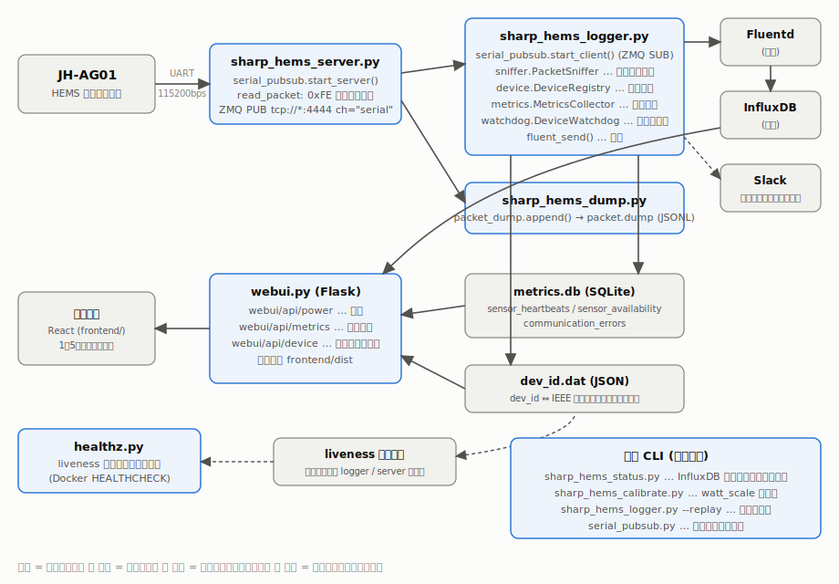
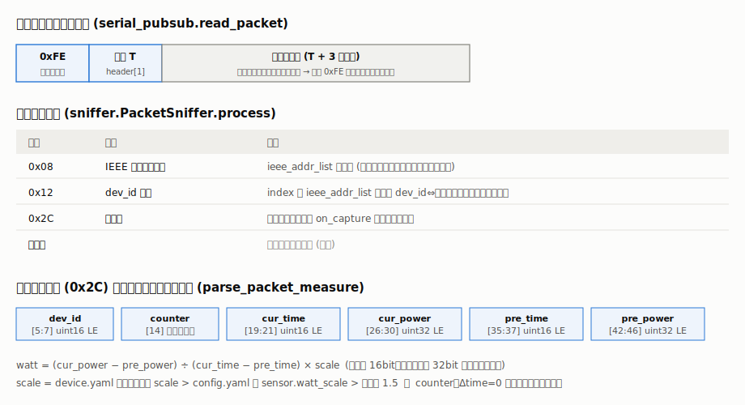
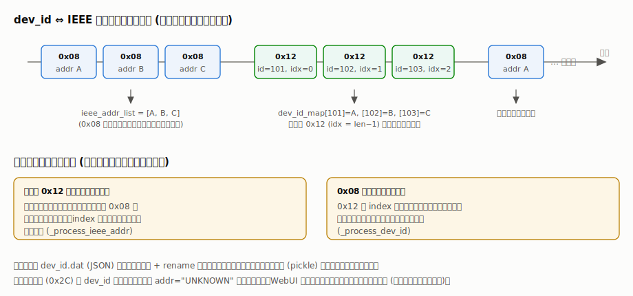
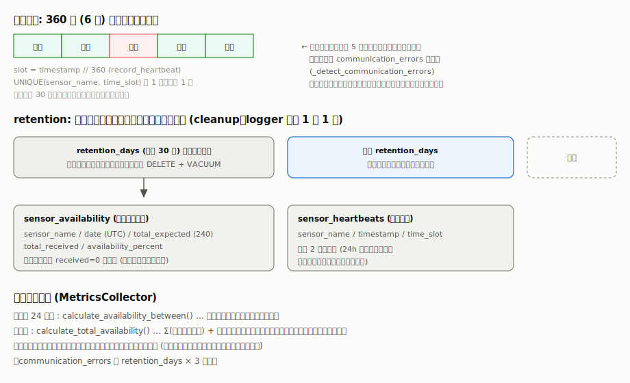
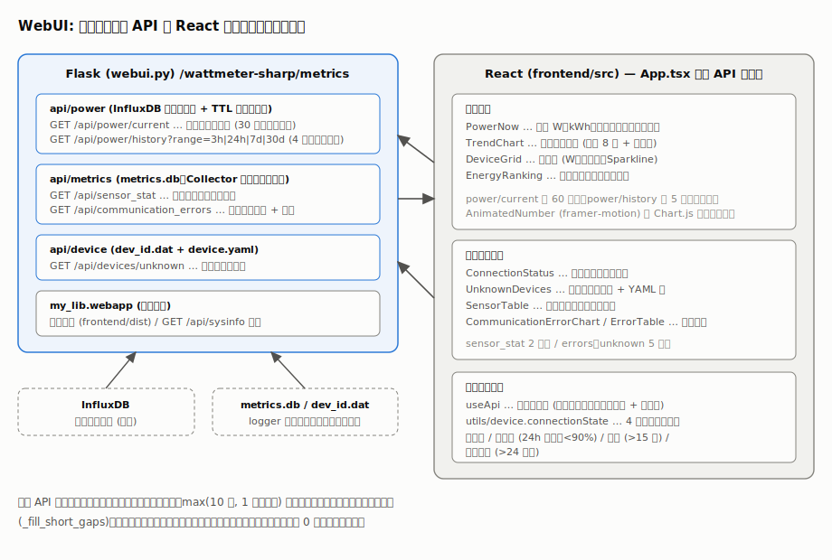

# アーキテクチャ

SHARP HEMS コントローラ JH-AG01 の内部シリアル通信を解析して電力データを収集・可視化する、
本リポジトリのソフトウェア構成を説明します。

## 全体構成

役割の異なる複数のプロセスが、ZeroMQ の PubSub とファイル (SQLite / JSON) を介して連携します。



| プロセス       | 実体                          | 役割                                                                                           |
| -------------- | ----------------------------- | ---------------------------------------------------------------------------------------------- |
| サーバー       | `src/sharp_hems_server.py`    | シリアルポートからパケットを読み出し、ZeroMQ PUB (既定ポート 4444、チャンネル `serial`) で配信 |
| ロガー         | `src/sharp_hems_logger.py`    | ZeroMQ SUB で受信したパケットを解析し、Fluentd 送信・メトリクス記録・無応答監視を行う          |
| WebUI          | `src/webui.py`                | Flask で API と React フロントエンドを配信                                                     |
| ダンプ         | `src/sharp_hems_dump.py`      | 受信パケットを `packet.dump` (JSONL) に記録する開発用ツール                                    |
| ヘルスチェック | `src/healthz.py`              | liveness ファイルの鮮度を確認 (Docker の `HEALTHCHECK` からも実行)                             |
| 状態チェック   | `src/sharp_hems_status.py`    | InfluxDB に各デバイスのデータが届いているかを確認する CLI                                      |
| 較正           | `src/sharp_hems_calibrate.py` | スマートメータ実測値と突合して `watt_scale` の推奨値を提示する CLI                             |

サーバーとロガーを分離しているのは、シリアルポートを占有するプロセスを 1 つに保ちながら、
ロガー・ダンプなど複数の購読者を同時に接続できるようにするためです
(`src/sharp_hems/serial_pubsub.py`)。

各プロセスは `pyproject.toml` の `[project.scripts]` により
`wattmeter-logger` / `wattmeter-server` / `wattmeter-webui` などのコマンドとしてもインストールされます。

## シリアルプロトコルとパケット解析

JH-AG01 の内部 UART (115200bps) を流れるパケットは、
同期バイト `0xFE` + 種別バイトの 2 バイトヘッダに、種別値 + 3 バイトのペイロードが続く構造です。



- **フレーミング** (`serial_pubsub.read_packet`):
  同期バイトが現れるまで 1 バイトずつ読み捨て、ペイロードが期待長に満たなければ破棄します。
  ノイズや途中起動でストリーム位置がずれても、次のパケット境界で自動的に再同期します。
- **解析** (`sniffer.PacketSniffer`):
  種別 `0x08` (IEEE アドレス通知)・`0x12` (dev_id 通知)・`0x2C` (計測値) を処理します。
  計測値は「前回からの電力積算差 ÷ 経過時間 × 補正倍率」で W に換算します。
  補正倍率は `device.yaml` のデバイス毎 `scale` → `config.yaml` の `sensor.watt_scale` → 既定値 1.5 の順で解決します。
- **重複除去**: 同一パケットが 2 回届くことがあるため、パケット内のカウンタと Δtime=0 で棄却します。

## dev_id と IEEE アドレスの対応学習

計測パケットにはデバイスの IEEE アドレスが含まれず、短い `dev_id` しか入っていません。
JH-AG01 が周期的に送る「IEEE アドレス通知 (0x08) の列 → dev_id 通知 (0x12) の列」の順序対応から、
`dev_id` ⇔ IEEE アドレスの対応表を自動学習します。



学習結果は `device.cache` で指定したファイル (既定 `data/dev_id.dat`) に JSON で永続化されます
(一時ファイル + rename によるアトミック書込み。旧 pickle 形式は初回読込時に自動移行)。
IEEE アドレスからデバイス名への解決は `device.DeviceRegistry` が
`device.yaml` (mtime を見て自動リロード) を使って行います。

## メトリクス (受信状態の記録)

ワイヤレス接続の切断を把握するため、ロガーはデータ受信のたびに
`metrics.MetricsCollector` で SQLite (`metrics.db`) にハートビートを記録します。



- 時間軸はセンサーの送信周期 (約 6 分) に合わせた **360 秒のタイムスロット**。
- 短い欠測 (直前 5 スロット以内に受信がある場合) は `communication_errors` に記録し、
  WebUI の「切断が起きやすい時間帯」ヒストグラムの元データになります。
- **retention**: `metrics.retention_days` (既定 30 日) より古いハートビートは、
  1 日 1 回 `cleanup()` が日次サマリー (`sensor_availability`) に畳み込んでから削除し、`VACUUM` します。
  累計受信率は「日次サマリー + 直近の生データ」の合算で計算するため、
  運用年数が伸びてもクエリコストが増えません。

### 無応答監視 (watchdog)

`watchdog.DeviceWatchdog` はロガーの受信ループから 1 分間隔で呼ばれ、
各デバイスの最終受信時刻を確認します。`alert.timeout_min` (既定 30 分) を超えて受信が無いと
Slack へ切断アラートを送り、受信が再開すると復帰通知を送ります (`notify.alert`)。
通知先は `config.yaml` の `slack` 設定 (`my_lib.notify.slack`) です。

## WebUI

Flask (`src/webui.py`) が API と、ビルド済み React (`frontend/dist`) の静的配信を担います。



### バックエンド API (`src/sharp_hems/webui/api/`)

| Blueprint | エンドポイント              | データソース             | 備考                                                                                                       |
| --------- | --------------------------- | ------------------------ | ---------------------------------------------------------------------------------------------------------- |
| `power`   | `/api/power/current`        | InfluxDB                 | 全デバイス並列クエリ、30 秒 TTL キャッシュ。直近 10 分の最新値のみを「現在」とする                         |
| `power`   | `/api/power/history?range=` | InfluxDB                 | 3h/24h/7d/30d、4 分 TTL キャッシュ。末尾の未受信スロットは max(10 分, 1 スロット) 以内なら直近値で前方補完 |
| `metrics` | `/api/sensor_stat`          | metrics.db               | 受信率 (24h/累計)・最終受信時刻。`MetricsCollector` はアプリ単位で共有                                     |
| `metrics` | `/api/communication_errors` | metrics.db               | 時間帯別ヒストグラム (30 分刻み 48 bin) + 最新ログ                                                         |
| `device`  | `/api/devices/unknown`      | dev_id.dat + device.yaml | 観測済みだが未登録のデバイス                                                                               |

電力値そのものは Fluentd → InfluxDB の経路で蓄積されたものを読むため、
WebUI は InfluxDB (電力) と metrics.db (受信状態) の 2 つのデータソースを持ちます。

### フロントエンド (`frontend/`)

React 19 + Vite + Chart.js の SPA で、「電力」と「接続状態」の 2 タブ構成です。

- `hooks/useApi.ts` が各 API を 1〜5 分間隔でポーリングします。
  取得失敗時は前回データを保持したままエラーバナーを表示し、画面が消えないようにしています。
- 接続状態は `utils/device.ts` の `connectionState()` が
  **接続中 / 不安定 (24h 受信率 < 90%) / 切断 (15 分超) / 長期切断 (24 時間超)** の 4 段階に判定します。
- 数値は `AnimatedNumber` (framer-motion のスプリング) でカウントアップし、
  チャートは Chart.js のアニメーションでモーフィングします。
- デバイスカードの `Sparkline` は、受信できなかった時間帯を赤いティックで示します。

## 設定

| ファイル      | 内容                                                                                                                           | 検証                                                                   |
| ------------- | ------------------------------------------------------------------------------------------------------------------------------ | ---------------------------------------------------------------------- |
| `config.yaml` | 接続先 (serial / fluentd / influxdb)、デバイス定義ファイルの場所、メトリクス、`sensor.watt_scale`、`alert`、`calibration` など | `sharp_hems.config` の Pydantic モデル (`AppConfig`)。未知のキーは許容 |
| `device.yaml` | IEEE アドレスとデバイス名の一覧 (任意でデバイス毎の `scale`)                                                                   | 同 `DeviceEntry`                                                       |

サンプルは `config.example.yaml` / `device.example.yaml` を参照してください。

## ディレクトリ構成

```
src/
├── sharp_hems_server.py      # シリアル読取 + ZMQ PUB
├── sharp_hems_logger.py      # 受信・解析・送信・監視 (--replay でダンプ再生)
├── sharp_hems_dump.py        # パケットダンプ
├── sharp_hems_status.py      # InfluxDB データ有無チェック
├── sharp_hems_calibrate.py   # watt_scale 較正
├── healthz.py                # liveness チェック
├── webui.py                  # Flask アプリ
└── sharp_hems/
    ├── serial_pubsub.py      # フレーミングと ZMQ PubSub
    ├── sniffer.py            # パケット解析 (PacketSniffer)
    ├── device.py             # device.yaml の管理 (DeviceRegistry)
    ├── config.py             # 設定の Pydantic 検証
    ├── notify.py             # Slack 通知
    ├── watchdog.py           # 無応答監視
    ├── packet_dump.py        # ダンプの読み書き (JSONL / 旧 pickle)
    ├── metrics/collector.py  # 受信メトリクス (SQLite)
    └── webui/api/            # Flask Blueprint (power / metrics / device)

frontend/                     # React SPA (ビルド出力は frontend/dist)
tests/                        # pytest (単体・API 契約・Playwright E2E)
```

## テスト

- `tests/test_sniffer.py` — パケット解析・dev_id 学習・フレーミング再同期・キャッシュ移行
- `tests/test_metrics.py` — タイムスロット・受信率・retention の畳み込み
- `tests/test_features.py` — watchdog の通知遷移、較正の倍率計算
- `tests/test_webui_api.py` — Flask `test_client` による API 契約テスト (InfluxDB はモック)
- `tests/test_basic.py` — `tests/data/packet.dump` の実パケットを使った PubSub / 解析の結合テスト
- `tests/test_playwright.py` — WebUI の E2E テスト

## デプロイ

`Dockerfile` は uv で依存をインストールする 2 段構成で、既定の `CMD` はロガーです
(`HEALTHCHECK` は `healthz.py`)。CI (`.gitlab-ci.yml`) がフロントエンドのビルド、
テスト、マルチアーキテクチャ (amd64/arm64) のイメージビルド、デプロイまでを行います。
本番の `config.yaml` / `device.yaml` は別リポジトリ (wattmeter-config) から取得されます。
